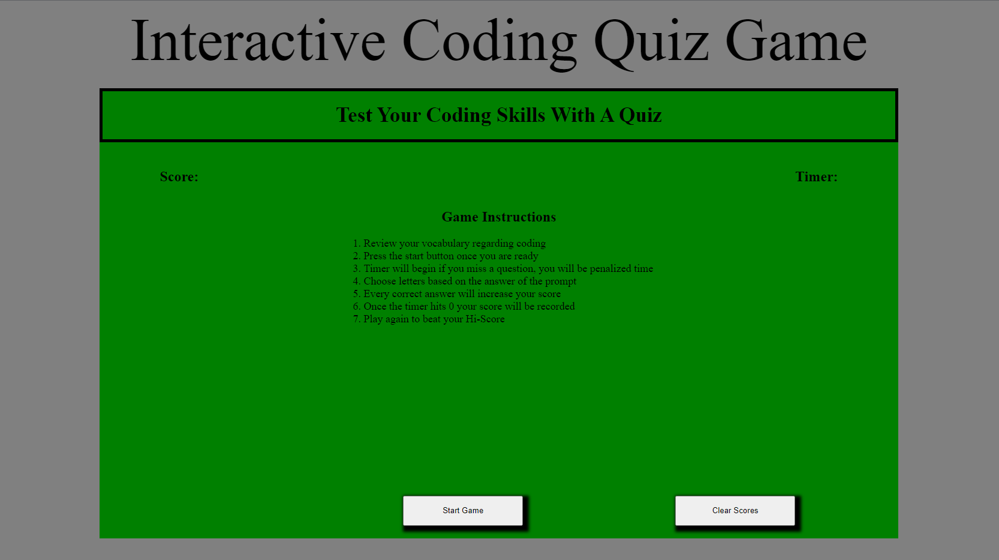
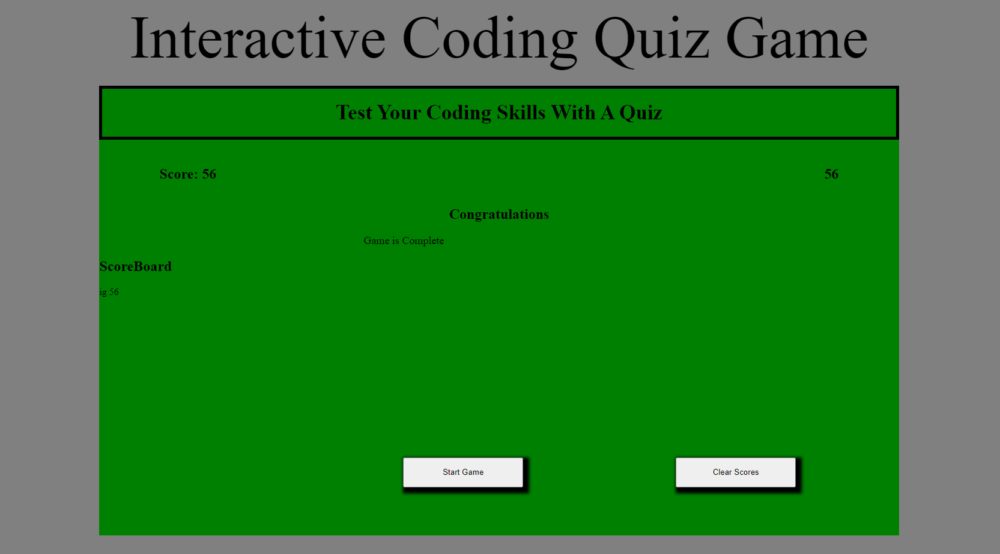

# Interactive-Coding-Quiz-Game

## Description
This game is made using HTML,CSS, and Javascript leaning more on the interactivity provided by Javascript. It can be used to test yourself against the clock on some coding basics. The game will start on clicking the button and the timer will begin, if user gets a question wrong then 5 seconds will be lost. On completion of the game the Score will be logged with your initials which can be saved for future attempts. If you would like a fresh start just clear your scores.
[Deployed Github Webpage](https://ignaciog08.github.io/Interactive-Coding-Quiz-Game/)

## Visuals

## Installation

N/A

## Usage
This can be used simply to test your skills with coding or to be inspected to see a basic Javascript quiz game

## Credits

N/A

## License

N/A
